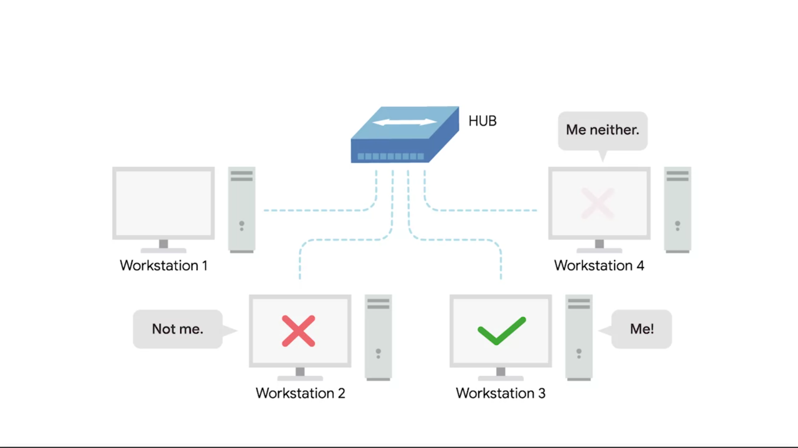
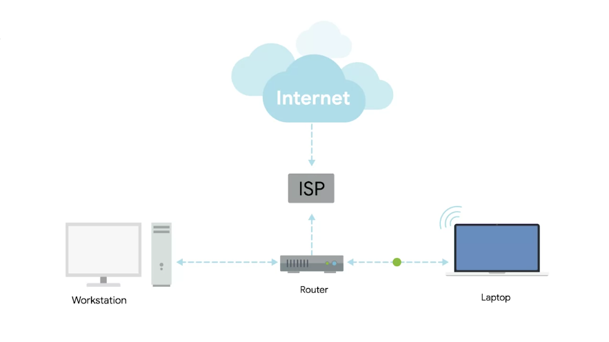

Lots of different cables and network devices can be used to allow computers to properly communicate with each other.

By the end of this lesson, you'll be able to identify and describe various networking cables
and networking devices.

Computer networking is a huge part of the day to day role of
many IT specialists. Knowing how to differentiate different network devices will be essential to your success. Let's start with the most basic component of a wired network.

# Cables
Cables: cables are what connect different devices to each other, allowing data to be
transmitted over them. Most network cables used today can be split into two categories:
copper and fiber.

Copper cables are the most common form of networking cable. They're made up of multiple pairs of copper wires inside plastic insulator. You may already know that computers communicate in binary, which people represent with ones and zeros.

The sending device communicates binary data across these copper wires by changing the voltage between two ranges. The system at the receiving end is able to interpret these voltage changes as binary ones and zeros, which can then be translated into different forms of data. 

The most common forms of copper twisted pair cables used in networking, are Cat 5, Cat 5e, and Cat 6 cables. These are all shorthand ways of saying category 5 or category 6 cables.

These categories have different physical characteristics, like the number of twists in the pair of copper wires that results in different usable lengths and transfer rates. 

Cat 5 is older and has been mostly replaced by Cat 5e and Cat 6 cables. From the outside they all look about the same and even internally, they're very similar to the naked eye.

The important thing to know is that differences in how the twisted pairs are arranged inside these cables can drastically alter how quickly data can be sent across them and how resistant these signals are to outside interference.

Cat 5e cables have mostly replaced those older Cat 5 cables because their internals reduce cross-talk.

Cross-talk is when an electrical pulse on one wire is accidentally detected on another wire. The receiving end isn't able to understand the data causing a network error.

Higher level protocols have methods for detecting missing data and asking for
the data a second time, but of course this takes up more time.

The higher quality specifications of a Cat 5e cable make it less likely that data needs to be re-transmitted. That means on average, you can expect more data to be transferred in the same amount of time.

Cat 6 cables, following even more strict specification to avoid cross-talk, making those cables more expensive. Cat 6 cables can transfer data faster and more reliably than Cat 5e cables can, but because of their internal arrangement, they have a shorter maximum distance when used at higher speeds.

The second primary form of networking cable is known as fiber, short for fiber-optic cables. Fiber cables contain individual optical fibers, which are tiny tubes made out of glass about the width of a human hair.

These tubes of glass can transport beams of light. Unlike copper, which uses
electrical voltages, fiber cables use pulses of light to represent the ones and zeros of the underlying data.

Fiber is even sometimes used specifically in environments where there's a lot of electromagnetic interference from outside sources because this can impact data being sent across copper wires.

Fiber cables can generally transport data quicker than copper cables can, but they're much more expensive and fragile. Fiber can also transport data over much longer distances than copper can without suffering potential data loss.

Now you know a lot more about the pros and cons of fiber cables,
but keep in mind, you'll be way more likely to run into fiber cables in computer data centers than you would in an office or at home.

---

We're going to do a rundown of network devices in this video, and the next one.

Almost every IT specialist will have to interact with these sorts of devices on a regular basis.

Cables allow you to form point-to-point networking connections. These are networks where only a single device at each end of the link exists.

Not to knock point to point networking connections, but they're not super useful in a world with billions of computers. Luckily, there are network
devices that allow for many computers to communicate with each other. The most simple of these devices is a hub.

# Hub
A hub is a physical layer device that allows for connections from many computers at once. All the devices connected to a hub will end up talking to all other devices at the same time. It's up to each system connected to the
hub to determine if the incoming data was meant for them, or to ignore it if it isn't.

This causes a lot of noise on the network and creates what's called a collision domain.

## Collision Domain
**A collision domain**, is a network segment where only one device can communicate at a time. If multiple systems try sending data at the same time, the electrical pulses sent across the cable can interfere with each other.

![[collision_domain.png]]

This causes these systems to have to wait for a quiet period before they
try sending their data again. It really slows down network communications and is the primary reason hubs are fairly rare. They're mostly a historical
artifact today.

# Switch
In much more common way of connecting many computers is with a more sophisticated device known as a network switch, originally known as a switching hub. A switch is very similar to a hub since you can connect many devices to it so they can communicate.

The difference is that while a **hub is a layer one or physical layer device**, a **switch is a layer two or data link device**. This means that a switch can actually inspect the contents of the Ethernet protocol data being sent
around the network, determine which system the data is intended for and then only send that data to that one system.

![[switch1.png]]

This reduces or even completely eliminates the size of collision domains on the network. If you guess that this will lead to fewer re-transmissions and higher overall throughput, you're right.

Hubs and switches are the primary devices used to connect computers on a single network, usually referred to as a **LAN, or local area network**. But we often want to send or receive data to computers on other networks, this is where routers come into play.

# Router
A router is a device that knows how to forward data between independent networks. While a hub is a layer 1 device and a switch is a layer 2 device, **a router operates at layer 3, a network layer**. Just like a switch can inspect Ethernet data to determine where to send things, a router can inspect IP data to determine where to send things.

![[router1.png]]

Routers store internal tables containing information about how to route traffic between lots of different networks all over the world.

The most common type of router you'll see is one for a home network or a small office. These devices generally don't have very detailed routing tables.

The purpose of these routers is mainly just to **take traffic originating from inside the home or office LAN** and to **forward it along to the ISP, or Internet service provider**.

Once traffic is at the ISP, a way more sophisticated type of router takes over. These core routers form the backbone of the Internet, and are directly responsible for how we send and receive data all over the Internet every single day. 

Core ISP routers don't just handle a lot more traffic than a home or small office router, they also have to deal with much more complexity in making decisions about where to send traffic.

A core router usually has many different connections to many other routers. **Routers share data** with each other via a protocol known as **BGP, or Border Gateway Protocol**, that let's them learn about the most optimal paths to forward traffic.

When you open a web browser and load a web page, the traffic between computers and the web servers could have traveled over dozens of different routers. The Internet is incredibly large and complicated, and **routers are global guides for getting traffic to the right places**.

# Servers and Clients
All of the network devices you've just learned about, exist so
that computers can communicate with each other, whether they're in the same room or thousands of miles apart. We've been calling these devices nodes, and we'll keep doing that, but it's also important to understand the concepts of servers, and clients.

The simplest way to think of a server, is as something that provides data to something requesting that data. The thing receiving the data, is referred to as a client.

![[servers_clients1.png]]

While we often talk about nodes being servers or clients, the reason our definition uses a word as vague as something, is because it's not just nodes that can be servers or clients.

Individual computer programs running on the same node can be servers, an clients to each other too. It's also important to call out, that most devices aren't purely a server, or a client, almost all nodes are both at some point in time, quite the multitasking over achievers.

That all being said, in most network topographies, each node is primarily either a server, or a client. Sometimes we refer to an email server as an email server, even though it itself a client of a DNS server, why? Because its primary reason for existing, is to serve data to clients.

Likewise, if a desktop machine occasionally acts as a server in the sense that it provides data to another computer, its primary reason for existing, is to fetch data from servers so that the user at the computer, can do their work. To sum up, a server is anything that can provide data to a client, but we also use the words to refer to the primary purpose of various nodes on our network, got it? Cool, now it's time for a short, unrated quiz to test you on the basics of these networking devices.